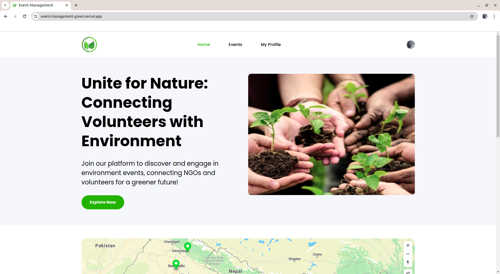
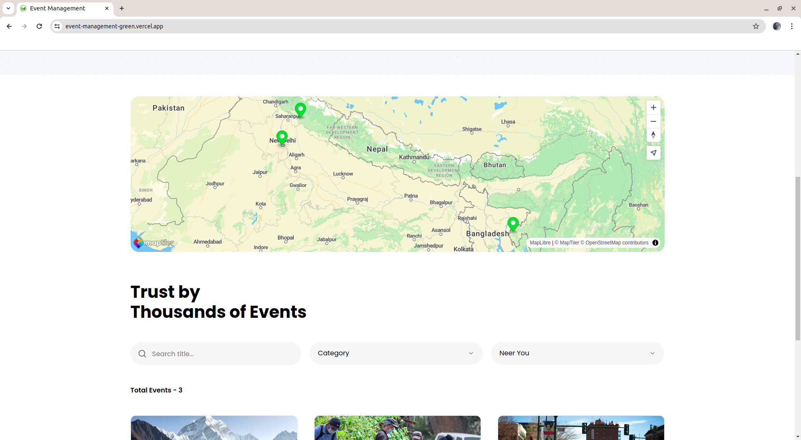
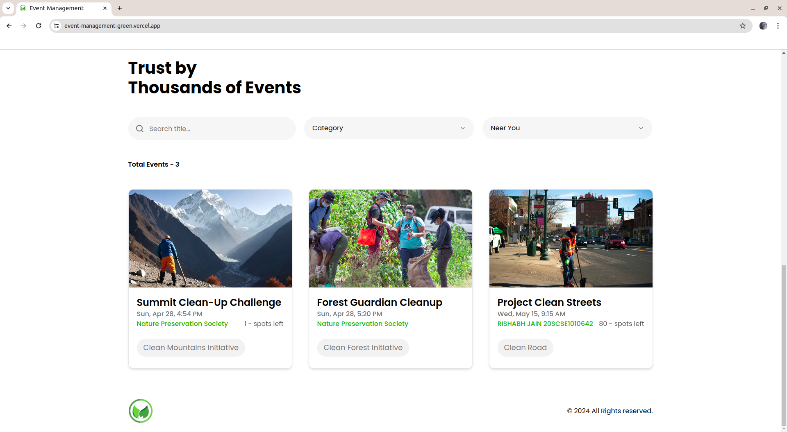
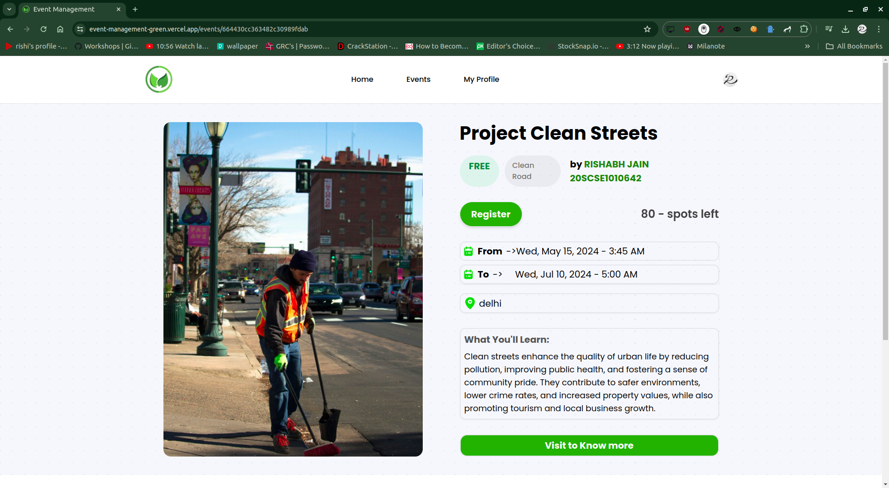
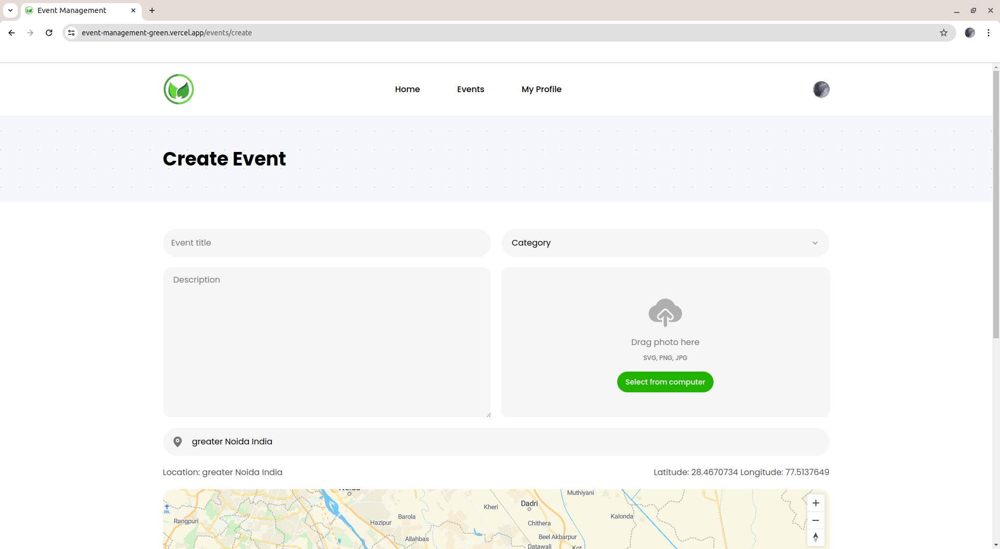
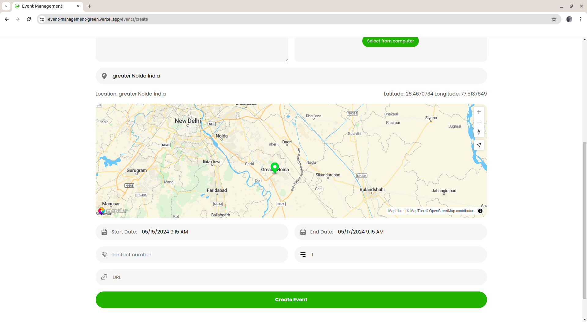

# Event management site for NGOs

- It is a very simple event management site for NGOs. It is a simple site where NGOs can create events and users can register for the events.
- All the events are listed on the home page and users can register for the events by clicking on the register button.
- Everything is modular and can be easily customized.

# Showcasing the event management site for NGOs

## Home Page

## Event Page

## Event Creation Page (for ngo only)

